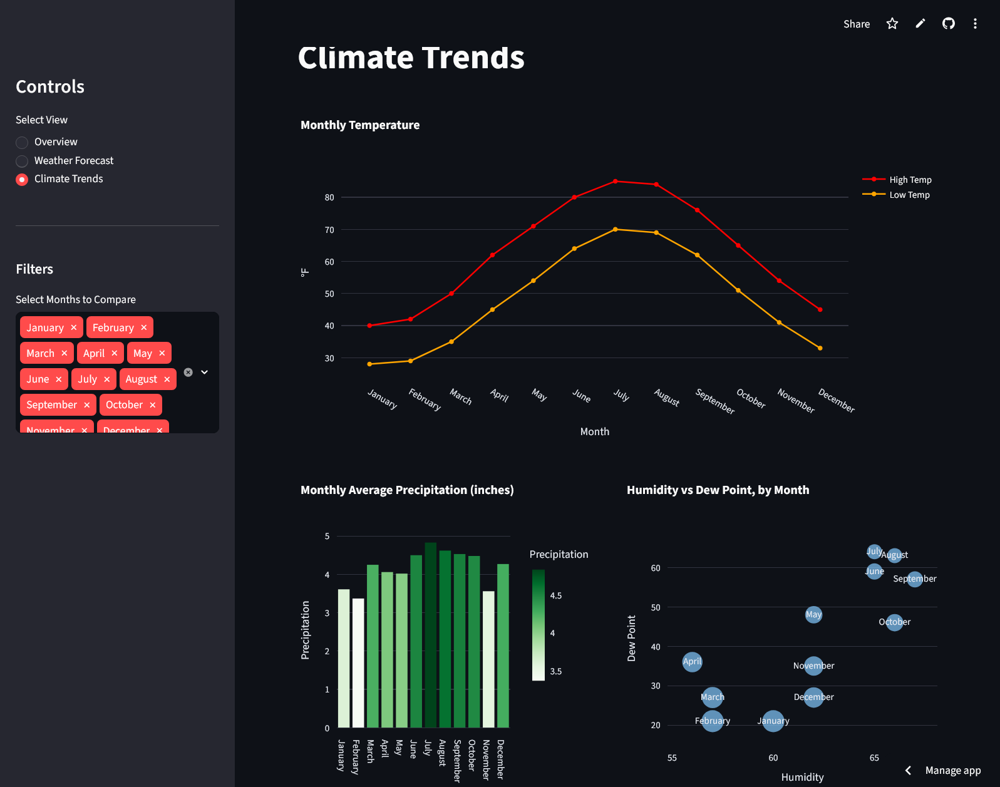

# Weather Web Scraping Project

A project that retrieves data from the [Weather Around The World](https://www.timeanddate.com/weather/) website. It involves web scraping with Selenium, data cleaning, transforming the data into a structured format, storing it in a SQLite database, and presenting it using Streamlit for interactive visualizations in a dashboard. Preview a [deployed version here](https://stevenh-weather-web-scraping.streamlit.app/)!

## Installation

- Fork this repository.

- Install dependencies:

    ```Bash
    pip install -r requirements.txt`
    ```

- If you'd like to update the data used, move to directory and run:

    ```Bash
    python scraper.py
    ```

- Start the Streamlit app using:

    ```Bash
    streamlit run dashboard.py
    ```

## Screenshot


